# 📊 UML Diagrams – AppTapchikhoakhoc

> **Ứng dụng Tạp Chí Khoa Học** – Android (Java + SQLite)  
> Ngày tạo: 2026-03-13

---

## Mục lục

1. [Biểu đồ Lớp (Class Diagram)](#1-biểu-đồ-lớp-class-diagram)
2. [Biểu đồ Use Case](#2-biểu-đồ-use-case)
3. [Biểu đồ Tuần Tự – Đăng nhập](#3-biểu-đồ-tuần-tự--đăng-nhập)
4. [Biểu đồ Tuần Tự – Đăng bài viết (User)](#4-biểu-đồ-tuần-tự--đăng-bài-viết-user)
5. [Biểu đồ Tuần Tự – Duyệt bài (Admin)](#5-biểu-đồ-tuần-tự--duyệt-bài-admin)
6. [Biểu đồ Tuần Tự – Bình luận & Reaction](#6-biểu-đồ-tuần-tự--bình-luận--reaction)
7. [Biểu đồ Hoạt Động – Luồng chính User](#7-biểu-đồ-hoạt-động--luồng-chính-user)
8. [Biểu đồ Hoạt Động – Luồng Admin xử lý bài](#8-biểu-đồ-hoạt-động--luồng-admin-xử-lý-bài)
9. [Biểu đồ Trạng Thái – Article](#9-biểu-đồ-trạng-thái--article)
10. [Biểu đồ Thành Phần (Component Diagram)](#10-biểu-đồ-thành-phần-component-diagram)
11. [Biểu đồ Gói (Package Diagram)](#11-biểu-đồ-gói-package-diagram)
12. [Biểu đồ Cơ Sở Dữ Liệu (ERD)](#12-biểu-đồ-cơ-sở-dữ-liệu-erd)

---

## 1. Biểu đồ Lớp (Class Diagram)

```mermaid
classDiagram
    direction TB

    %% ═══════════════ MODEL ═══════════════
    class Article {
        -int id
        -String title
        -String author
        -String category
        -String content
        -String imagePath
        -String videoPath
        -int likes
        -int comments
        -int shares
        -String status
        -String userEmail
        -long approvedAt
        +getId() int
        +getTitle() String
        +getAuthor() String
        +getCategory() String
        +getContent() String
        +getImagePath() String
        +getVideoPath() String
        +getLikes() int
        +getComments() int
        +getShares() int
        +getStatus() String
        +getUserEmail() String
        +getApprovedAt() long
        +setStatus(String)
        +setLikes(int)
        +setComments(int)
        +setShares(int)
    }

    class Comment {
        -int id
        -int articleId
        -String userName
        -String userEmail
        -String content
        -long timestamp
        +getId() int
        +getArticleId() int
        +getUserName() String
        +getUserEmail() String
        +getContent() String
        +getTimestamp() long
    }

    %% ═══════════════ DATA ═══════════════
    class DatabaseHelper {
        -String DB_NAME
        -int DB_VERSION
        +STATUS_PENDING$ String
        +STATUS_APPROVED$ String
        +STATUS_REJECTED$ String
        +getPendingArticles() ArrayList~Article~
        +getApprovedArticles() ArrayList~Article~
        +getRejectedArticles() ArrayList~Article~
        +getAllArticles() ArrayList~Article~
        +getArticlesByCategory(String) ArrayList~Article~
        +getFeaturedArticles() ArrayList~Article~
        +getLatestApprovedArticles(int) ArrayList~Article~
        +searchArticles(String) ArrayList~Article~
        +insertArticle(String,...) long
        +insertPendingArticle(String,...) long
        +updateArticle(int,...) boolean
        +deleteArticle(int) boolean
        +approveArticle(int) boolean
        +rejectArticle(int) boolean
        +registerUser(String,String,String) boolean
        +checkLogin(String,String) boolean
        +isEmailExists(String) boolean
        +getUserName(String) String
        +addComment(int,String,String,String,long) boolean
        +getCommentsByArticle(int) List~Comment~
        +addOrUpdateReaction(int,String,String) boolean
        +removeReactionFromDb(int,String) boolean
        +getUserReaction(int,String) String
        +getTotalApprovedArticles() int
        +getTotalPendingArticles() int
        +getTotalUsers() int
        +getTotalLikes() int
        +getTotalComments() int
    }

    class BaseActivity {
        #boolean isDarkMode
        -float appliedFontScale
        -String appliedLocale
        #refreshThemeState()
        #getBackgroundColor() int
        #getCardColor() int
        #getTextColor() int
        #getAccentColor() int
        #applyAndSaveTextSize(String)
        #applyAndSaveLanguage(String)
        #lightenColor(int,float) int
        #darkenColor(int,float) int
    }

    class BaseAdminActivity {
        #boolean isDarkMode
        -String appliedAdminLocale
        #applyAndSaveAdminLanguage(String)
    }

    %% ═══════════════ MAIN ═══════════════
    class MainActivity {
        -DrawerLayout drawerLayout
        -NewsAdapter newsAdapter
        -FeaturedBannerAdapter bannerAdapter
        -String currentCategory
        +loadAllData()
        +updateUI(List~Article~)
        -loadFeaturedArticles()
        -filterArticlesByCategory()
        -handleAddArticle()
        -setupBanner(List~Article~)
        -startAutoSlide()
        -stopAutoSlide()
        +onNavigationItemSelected(MenuItem) boolean
    }

    class ArticleDetailActivity {
        -Article article
        -CommentAdapter commentAdapter
        -DatabaseHelper db
        +loadArticleDetail()
        -setupReactions()
        -setupComments()
        -submitComment()
        -shareArticle()
    }

    class LoginActivity {
        -DatabaseHelper db
        -loginUser()
        -validateInput() boolean
    }

    class RegisterActivity {
        -DatabaseHelper db
        -registerUser()
        -validateInput() boolean
    }

    class NotificationsActivity {
        -DatabaseHelper db
        -NotificationItemAdapter adapter
        +loadNotifications()
    }

    class SettingsActivity {
        -ThemeManager themeManager
        -LocaleManager localeManager
        -TextSizeManager textSizeManager
        +applyTheme()
        +changeLanguage(String)
        +changeTextSize(String)
    }

    class SearchActivity {
        -DatabaseHelper db
        -NewsAdapter newsAdapter
        +search(String)
    }

    class PrivacyActivity {
        +loadPrivacyContent()
    }

    %% ═══════════════ ADMIN ═══════════════
    class AdminActivity {
        -DatabaseHelper db
        -AdminArticleAdapter adapter
        +loadArticles()
        -openAddEdit()
        -deleteArticle(int)
    }

    class AddEditArticleActivity["AddEditArticleActivity (admin)"] {
        -DatabaseHelper db
        -ContentModerationHelper moderator
        +saveArticle()
        -pickImage()
        -pickVideo()
        -moderateContent()
    }

    class AddEditArticleActivity_main["AddEditArticleActivity (main)"] {
        -DatabaseHelper db
        -ContentModerationHelper moderator
        +submitPendingArticle()
        -pickImage()
        -pickVideo()
    }

    class ApproveArticleActivity {
        -DatabaseHelper db
        -ApproveArticleAdapter adapter
        +loadPendingArticles()
        -approveArticle(int)
        -rejectArticle(int)
    }

    class LoginAdminActivity {
        -checkAdminCredentials() boolean
    }

    class StatsActivity {
        -DatabaseHelper db
        +loadStats()
    }

    class ContactAdminActivity {
        +loadContactInfo()
    }

    class AdminSearchActivity["SearchActivity (admin)"] {
        -DatabaseHelper db
        +search(String)
    }

    class AdminSettingsActivity["SettingsActivity (admin)"] {
        -AdminThemeManager themeManager
        -AdminLocaleManager localeManager
        +applyAdminTheme()
        +changeAdminLanguage(String)
    }

    %% ═══════════════ ADAPTER ═══════════════
    class NewsAdapter {
        -List~Article~ articleList
        -Context context
        +setList(List~Article~)
        +onCreateViewHolder(...) ViewHolder
        +onBindViewHolder(...) void
        +getItemCount() int
    }

    class FeaturedBannerAdapter {
        -List~Article~ articles
        -Context context
        +updateArticles(List~Article~)
        +setOnItemClickListener(OnItemClickListener)
        +refreshTheme()
    }

    class CommentAdapter {
        -List~Comment~ commentList
        -DatabaseHelper db
        -String currentUserEmail
        +setList(List~Comment~)
        +deleteComment(int)
        +showReactionPicker(int)
    }

    class RelatedNewsAdapter {
        -List~Article~ articles
        +setList(List~Article~)
    }

    class AdminArticleAdapter {
        -List~Article~ articles
        +setOnEditListener(OnEditListener)
        +setOnDeleteListener(OnDeleteListener)
    }

    class ApproveArticleAdapter {
        -List~Article~ articles
        +setOnApproveListener(OnApproveListener)
        +setOnRejectListener(OnRejectListener)
    }

    class NotificationItemAdapter {
        -List~Article~ articles
    }

    %% ═══════════════ UTILS ═══════════════
    class ThemeManager {
        -PREFS_NAME$ String
        +isDarkMode(Context) bool$
        +setDarkMode(Context,bool)$
        +toggleTheme(Context)$
        +getBackgroundColor(Context) int$
        +getStatusBarColor(Context) int$
        +getTextPrimaryColor(Context) int$
        +getAccentColor(Context) int$
    }

    class AdminThemeManager {
        +isDarkMode(Context) bool$
        +setDarkMode(Context,bool)$
        +getBackgroundColor(Context) int$
    }

    class LocaleManager {
        +getSavedLanguage(Context) String$
        +saveLanguage(Context,String)$
        +applyLocale(Context,String) Context$
    }

    class AdminLocaleManager {
        +getSavedLanguage(Context) String$
        +saveLanguage(Context,String)$
        +applyLocale(Context,String) Context$
    }

    class TextSizeManager {
        +getFontScale(Context) float$
        +setTextSize(Context,String)$
        +applyTextSize(Context) Context$
    }

    class ContentModerationHelper {
        -API_KEY$ String
        -API_URL$ String
        -MODEL$ String
        +moderate(String,String,ModerationCallback)$
        -callApi(String,String) String$
        -buildPrompt(String,String) String$
        -stripHtml(String) String$
    }

    class ModerationCallback {
        <<interface>>
        +onApproved()
        +onRejected(String)
        +onError(String)
    }

    class AutoApproveHelper {
        +scheduleAutoApprove(Context,int,long)$
        +cancelAutoApprove(Context,int)$
    }

    class AutoApproveWorker {
        -DatabaseHelper db
        +doWork() Result
    }

    class CategoryBadgeHelper {
        +getCategoryColor(String) int$
        +getCategoryIcon(String) int$
    }

    %% ═══════════════ RELATIONSHIPS ═══════════════
    Article --> Comment : "1 → *"
    DatabaseHelper --> Article : creates/manages
    DatabaseHelper --> Comment : creates/manages
    DatabaseHelper --|> SQLiteOpenHelper

    BaseActivity --|> AppCompatActivity
    BaseAdminActivity --|> AppCompatActivity

    MainActivity --|> BaseActivity
    ArticleDetailActivity --|> BaseActivity
    LoginActivity --|> BaseActivity
    RegisterActivity --|> BaseActivity
    NotificationsActivity --|> BaseActivity
    SettingsActivity --|> BaseActivity
    SearchActivity --|> BaseActivity
    PrivacyActivity --|> BaseActivity
    AddEditArticleActivity_main --|> BaseActivity

    AdminActivity --|> BaseAdminActivity
    AddEditArticleActivity --|> BaseAdminActivity
    ApproveArticleActivity --|> BaseAdminActivity
    LoginAdminActivity --|> AppCompatActivity
    StatsActivity --|> BaseAdminActivity
    ContactAdminActivity --|> BaseAdminActivity
    AdminSearchActivity --|> BaseAdminActivity
    AdminSettingsActivity --|> BaseAdminActivity

    MainActivity --> DatabaseHelper : uses
    MainActivity --> NewsAdapter : uses
    MainActivity --> FeaturedBannerAdapter : uses
    ArticleDetailActivity --> DatabaseHelper : uses
    ArticleDetailActivity --> CommentAdapter : uses
    ApproveArticleActivity --> DatabaseHelper : uses
    AdminActivity --> DatabaseHelper : uses
    AddEditArticleActivity --> ContentModerationHelper : uses
    AddEditArticleActivity_main --> ContentModerationHelper : uses

    BaseActivity --> ThemeManager : delegates
    BaseActivity --> LocaleManager : delegates
    BaseActivity --> TextSizeManager : delegates
    BaseAdminActivity --> AdminThemeManager : delegates
    BaseAdminActivity --> AdminLocaleManager : delegates

    ContentModerationHelper --> ModerationCallback : callback
    AutoApproveWorker --> DatabaseHelper : uses
    AutoApproveHelper --> AutoApproveWorker : schedules
```

---

## 2. Biểu đồ Use Case

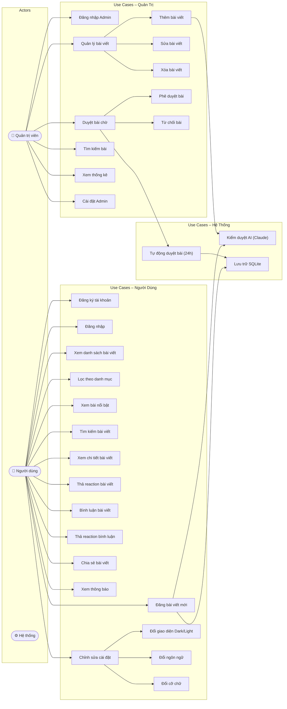

---

## 3. Biểu đồ Tuần Tự – Đăng nhập

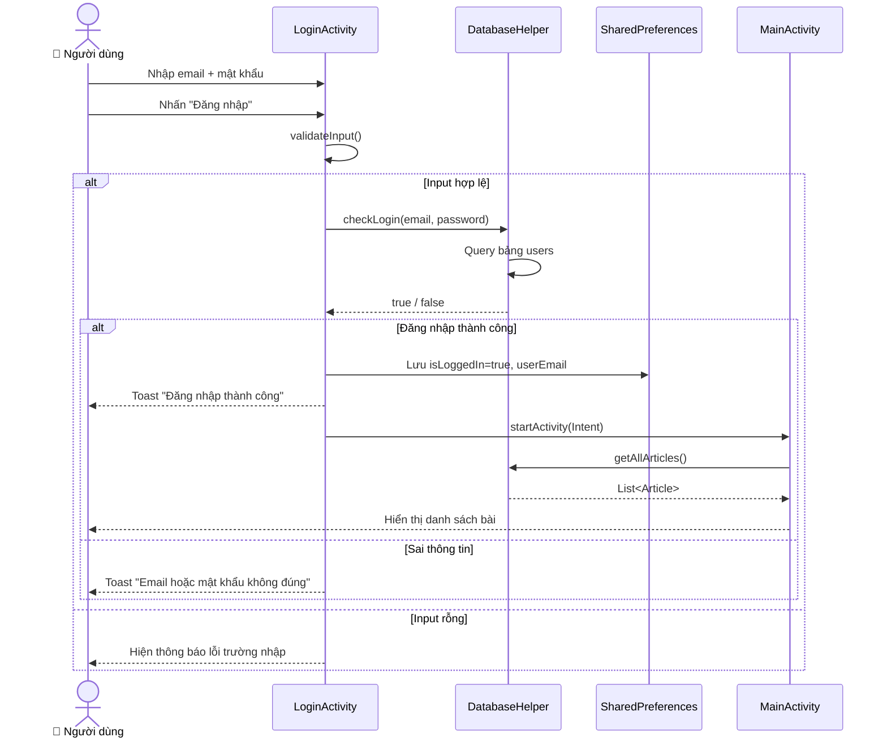

---

## 4. Biểu đồ Tuần Tự – Đăng bài viết (User)

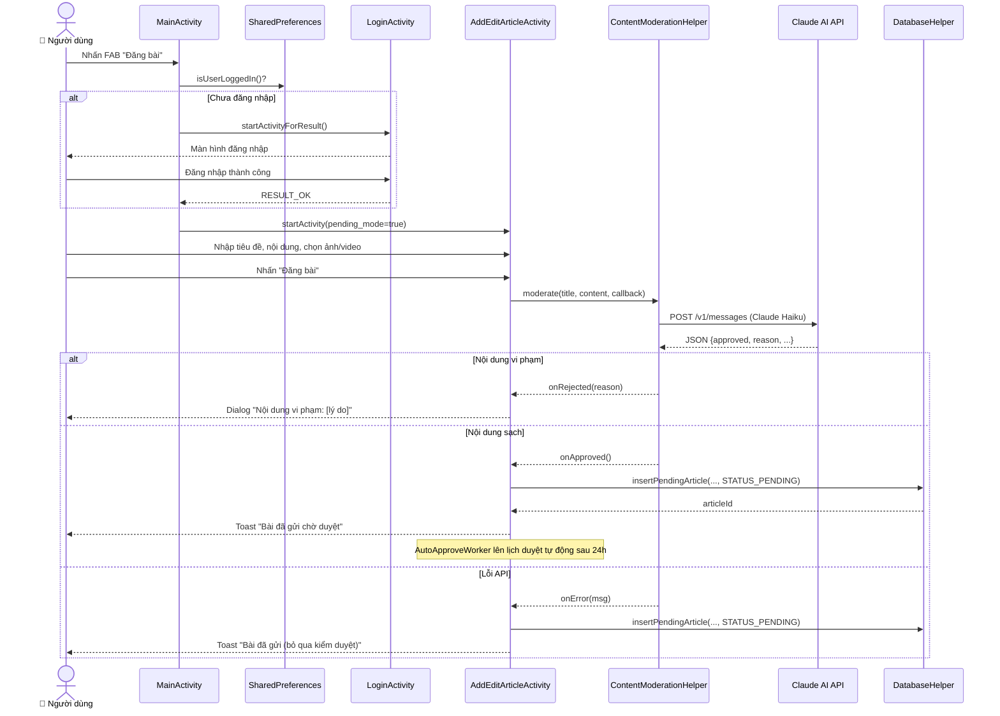

---

## 5. Biểu đồ Tuần Tự – Duyệt bài (Admin)

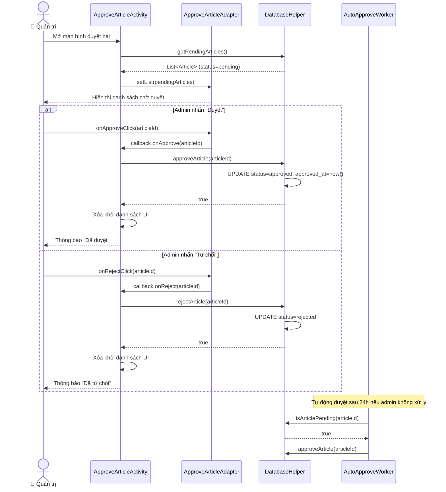

---

## 6. Biểu đồ Tuần Tự – Bình luận & Reaction

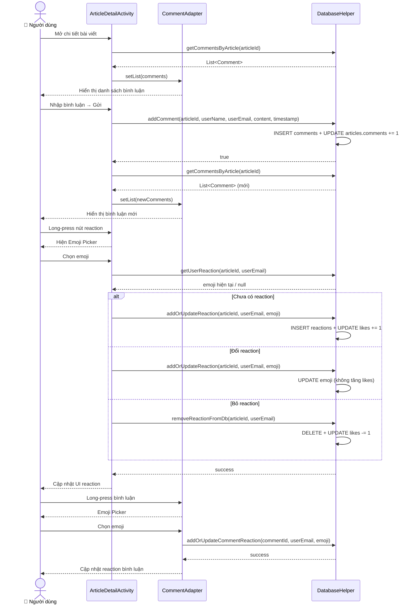

---

## 7. Biểu đồ Hoạt Động – Luồng chính User

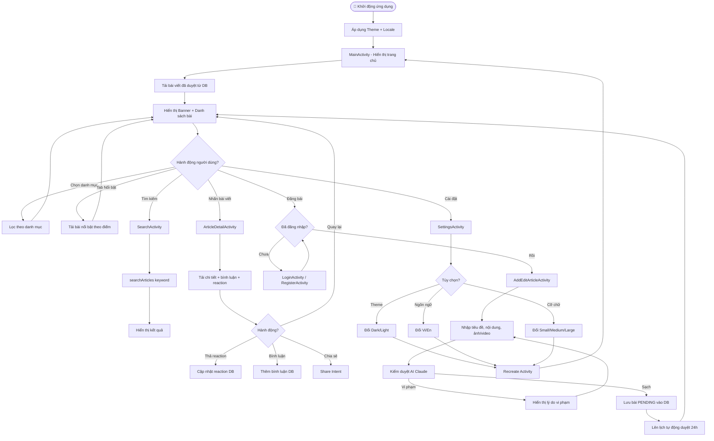

---

## 8. Biểu đồ Hoạt Động – Luồng Admin xử lý bài

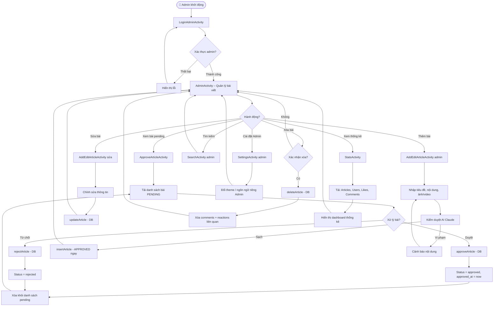

---

## 9. Biểu đồ Trạng Thái – Article

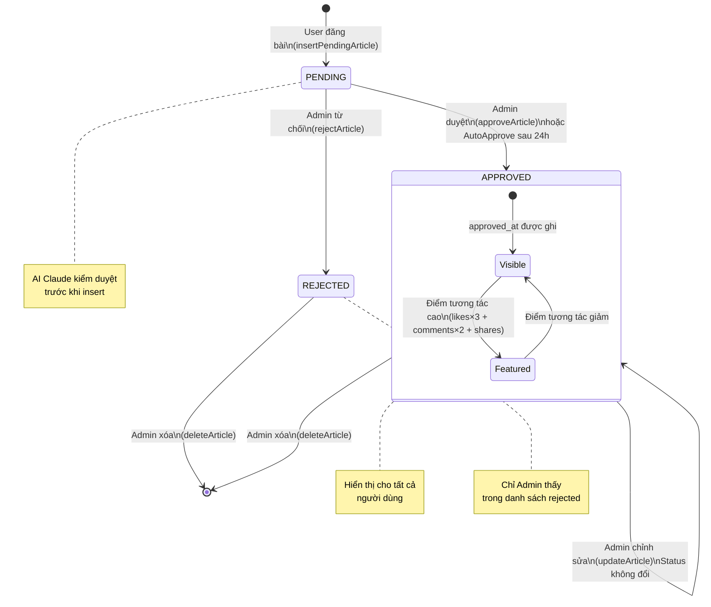

---

## 10. Biểu đồ Thành Phần (Component Diagram)

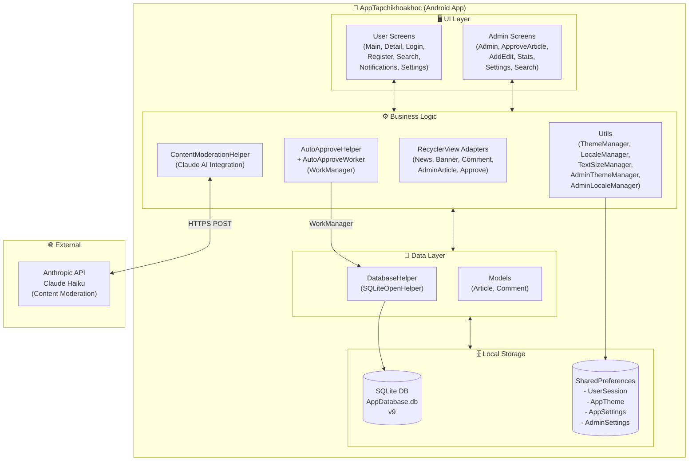

---

## 11. Biểu đồ Gói (Package Diagram)

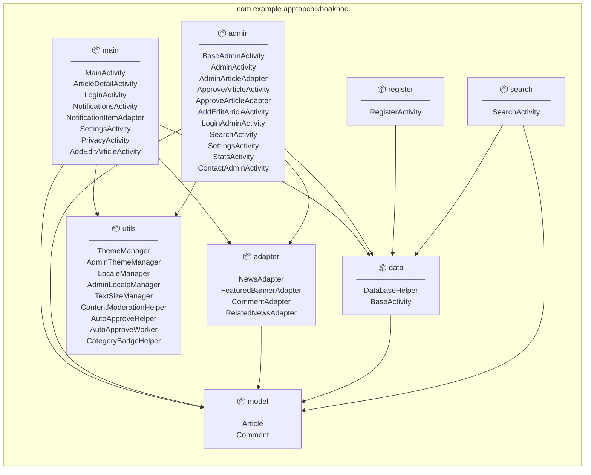

---

## 12. Biểu đồ Cơ Sở Dữ Liệu (ERD)

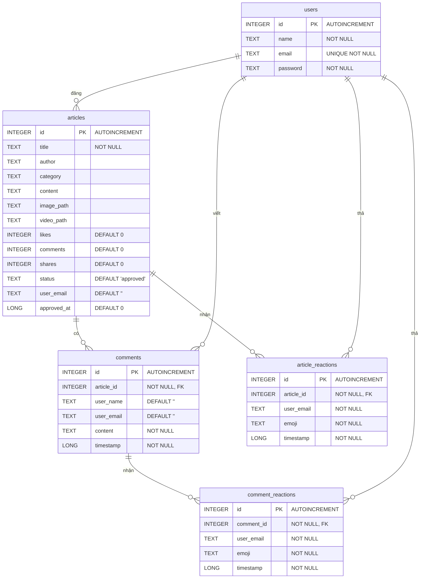

---

## Tổng kết kiến trúc

| Thành phần | Số lượng | Mô tả |
|---|---|---|
| **Packages** | 8 | model, data, utils, adapter, main, register, search, admin |
| **Activities (User)** | 8 | Main, Detail, Login, Register, Search, Notifications, Settings, Privacy |
| **Activities (Admin)** | 8 | Admin, Approve, AddEdit, Login, Search, Settings, Stats, Contact |
| **Adapters** | 7 | News, Banner, Comment, RelatedNews, AdminArticle, Approve, Notification |
| **Models** | 2 | Article, Comment |
| **Bảng DB** | 5 | users, articles, comments, article_reactions, comment_reactions |
| **Utils** | 9 | Theme×2, Locale×2, TextSize, Moderation, AutoApprove×2, CategoryBadge |
| **External API** | 1 | Anthropic API (Claude Haiku) |
